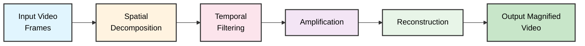
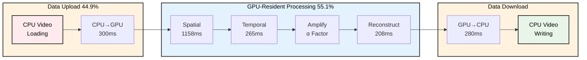
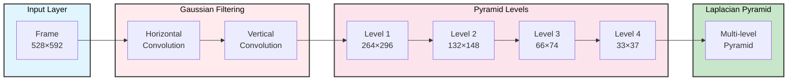

# Accelerating Eulerian Video Magnification using CUDA: A Performance Analysis and Implementation Study

## i. Abstract

Eulerian Video Magnification (EVM) is a powerful technique for revealing subtle temporal variations in videos, often imperceptible to the naked eye, by amplifying specific temporal frequency bands within a spatially decomposed video sequence. This project presents the design, implementation, and comprehensive performance analysis of both CPU and CUDA-accelerated EVM systems. The primary motivation is to significantly reduce the computational cost of EVM, enabling real-time applications and processing of larger datasets. Our CUDA implementation, leveraging a GPU-resident architecture and optimized kernels, achieves a significant overall speedup of up to **5.17×** compared to a reference CPU implementation when processing a standard test video (`face.mp4`). This report details the EVM algorithm, our parallelization strategies, extensive benchmarking results, an in-depth bottleneck analysis identifying the system as compute-bound due to algorithmic efficiency, and discusses potential future work. The source code for both implementations is available, facilitating further research and development in accelerated video processing.

## ii. Motivation & Significance

Eulerian Video Magnification (EVM), as introduced by Wu et al. [1], offers a remarkable capability to visualize minute changes in video sequences that are otherwise invisible. These subtle variations can carry significant information, such as the human pulse revealed through nearly imperceptible skin color changes [1], or the subtle vibrations of structures. Applications span diverse fields including medical diagnostics (e.g., non-contact physiological monitoring), mechanical engineering (e.g., structural integrity analysis, modal analysis), and general scientific discovery.

However, the computational demands of EVM, involving spatial decomposition (e.g., Laplacian pyramids) and temporal filtering across multiple video frames and spatial scales, can be substantial, particularly for high-resolution or long-duration videos. This computational intensity often restricts its application in real-time scenarios or large-scale analyses. Accelerating the EVM pipeline is therefore crucial for unlocking its full potential and broadening its applicability.

The massively parallel architecture of modern Graphics Processing Units (GPUs), accessed via frameworks like CUDA (Compute Unified Device Architecture), presents a compelling opportunity to address this computational bottleneck. By offloading the demanding stages of the EVM algorithm to the GPU, significant performance gains can be anticipated. This project is motivated by the prospect of transforming EVM into a more practical and efficient tool. The significance of this work lies in:
1.  Providing a detailed study of implementing and optimizing EVM on a GPU.
2.  Quantifying the performance benefits achievable through CUDA acceleration.
3.  Identifying key performance bottlenecks in a parallelized EVM pipeline, offering insights for future optimizations.
4.  Making EVM accessible for applications requiring faster processing, potentially enabling new use cases that were previously infeasible due to performance limitations.

This study aims to contribute to the field of applied parallel programming by demonstrating a practical application of GPU acceleration to a sophisticated computer vision algorithm, and providing a thorough analysis of the implementation challenges and outcomes.

## iii. Problem Statement

The core problem addressed in this project is the computationally intensive nature of the Eulerian Video Magnification (EVM) algorithm. Given a standard video sequence as input, the EVM process, as detailed by Wu et al. [1], involves several key steps:

1.  **Spatial Decomposition:** The input video frames are typically decomposed into a multi-resolution pyramid (e.g., Gaussian or Laplacian pyramid [1]). This step isolates different spatial frequency bands.
2.  **Temporal Filtering:** For each spatial frequency band at each pixel location, the time series of values is filtered using a temporal bandpass filter (e.g., IIR or FIR filters [1]) to isolate specific frequencies of interest (e.g., those corresponding to a human pulse or a specific mechanical vibration).
3.  **Amplification:** The filtered temporal signals are then amplified by a user-defined factor, α [1]. This amplification may be modulated based on spatial frequency to avoid excessive noise or artifact generation, particularly at higher spatial frequencies, guided by a cutoff wavelength λc [1].
4.  **Reconstruction:** The amplified, filtered signals are added back to the original signal (or a component thereof, like the lowest frequency band of the pyramid), and the spatial pyramid is collapsed to reconstruct the output video, which now reveals the magnified temporal variations.

The objective of this project is to design, implement, and evaluate a CUDA-accelerated version of this EVM algorithm. The specific goals include:
*   Developing a correct and functional CPU-based reference implementation of the EVM algorithm.
*   Designing and implementing a parallel CUDA version of the EVM algorithm, optimizing key computational kernels (spatial filtering, temporal filtering, reconstruction) for GPU execution.
*   Conducting a comprehensive performance analysis, comparing the CPU and CUDA implementations in terms of execution speed (overall and per-component).
*   Performing an in-depth bottleneck analysis of the CUDA implementation to identify limiting factors (e.g., compute-bound, memory-bound).
*   Achieving a significant speedup for the CUDA version over the CPU version, thereby demonstrating the efficacy of GPU acceleration for this problem.
*   Ensuring the quality of the magnified output is preserved in the accelerated version.

The successful completion of this project will result in a high-performance EVM system and a detailed report on its implementation and performance characteristics.
## iv. Prior Work & Limitations

The foundational work in Eulerian Video Magnification by Wu et al. [1] serves as the primary prior art for this project. Their paper introduced the core Eulerian approach, contrasting it with earlier Lagrangian methods [1] that rely on explicit motion tracking (e.g., Liu et al. [2]). Lagrangian techniques, while effective for certain types of motion magnification, often face challenges with computational expense, accuracy of motion estimation (especially at occlusion boundaries), and the need for complex auxiliary processes like motion segmentation and in-painting [1].

The Eulerian method, by analyzing temporal variations of pixel intensities at fixed locations within a spatially multi-scale framework, bypasses the need for explicit motion estimation for small motions [1]. Wu et al. demonstrated its efficacy for revealing imperceptible color changes (like blood flow) and small motions [1]. Their work laid out the theoretical basis, including the linear approximation for motion magnification and the bounds for this approximation [1]. They also discussed sensitivity to noise and the role of spatial pooling [1].

While the original paper [1] mentioned a real-time CPU-based prototype, it did not delve into a detailed performance analysis of a highly optimized parallel implementation on GPU architectures like CUDA. While other public implementations, such as the one found at `https://github.com/hbenbel/Eulerian-Video-Magnification` [3], exist and may have offered general insights into EVM, the CPU implementation for *this* project was developed independently, primarily utilizing OpenCV for its image processing functionalities. The primary limitation of the existing body of work, from the perspective of this project, is the gap in a comprehensive study of CUDA-based acceleration for EVM. This includes a detailed breakdown of performance gains, an analysis of bottlenecks specific to a GPU implementation, and an examination of various CUDA optimization strategies tailored for the EVM pipeline.

This project aims to address this gap by:
1.  Implementing a robust EVM pipeline on CUDA.
2.  Conducting a thorough performance comparison against a CPU reference.
3.  Analyzing the specific challenges and opportunities in parallelizing each stage of the EVM algorithm on a GPU.
4.  Investigating the performance characteristics, including speedup and bottlenecks, of the CUDA implementation.

The limitation of this current project is that it focuses primarily on the acceleration of the EVM algorithm as described by Wu et al. [1] and does not explore significant algorithmic variations or novel applications beyond performance enhancement.

## v. Theory/Algorithm

The Eulerian Video Magnification (EVM) technique, as conceptualized by Wu et al. [1], operates by amplifying subtle temporal changes in video sequences. The core idea is to process the video in a way that makes these imperceptible variations visible. This is achieved through a combination of spatial and temporal processing, without resorting to explicit motion tracking for small movements, characteristic of the Eulerian perspective.

### 1. Core EVM Algorithm

The EVM algorithm can be broken down into the following key stages [1]:

**Figure 1:** Core Eulerian Video Magnification algorithm pipeline. The algorithm processes video frames through five sequential stages to reveal subtle temporal variations.

**a. Spatial Decomposition:**
The input video frames are first decomposed into different spatial frequency bands. This is typically achieved by constructing a spatial pyramid, most commonly a Laplacian pyramid [1], for each frame. The Laplacian pyramid represents the frame as a series of band-pass filtered images, each capturing details at a different spatial scale, plus a low-frequency residual. Alternatively, a Gaussian pyramid can be used, especially if the goal is primarily spatial pooling to improve signal-to-noise ratio (SNR) for color amplification tasks [1]. This multi-scale representation is crucial because the signals of interest might have different characteristics at different spatial frequencies, and noise might also vary across scales.

**b. Temporal Filtering:**
For each spatial layer of the pyramid (i.e., each band-pass image) and at each pixel location within that layer, the sequence of pixel values over time forms a temporal signal. This signal is then subjected to temporal filtering. A bandpass filter is applied to isolate specific temporal frequencies of interest [1]. For instance, to visualize the human pulse, frequencies corresponding to typical heart rates (e.g., 0.83-1 Hz) would be selected [1]. The choice of filter (e.g., ideal bandpass, IIR, FIR) depends on the application requirements, such as sharp frequency cutoffs or real-time processing capabilities [1].

**c. Amplification:**
The temporally filtered signals, now representing the variations in the desired frequency band, are amplified by a magnification factor α [1]. This factor is a critical user-defined parameter that controls the degree of magnification. As derived in the original work [1], the first-order Taylor series approximation for motion magnification holds best for small motions and lower spatial frequencies. To prevent artifacts when this approximation breaks down (i.e., for large amplified motions (1+α)δ(t)) particularly at high spatial frequencies (small wavelengths λ), the amplification factor α may be attenuated for spatial wavelengths λ below a certain cutoff λc [1]. The condition $$(1+\alpha)\delta(t) < \frac{\lambda}{8}$$ provides a guideline for this [1].

**d. Reconstruction:**
The amplified, temporally filtered signals from each spatial band are then added back to the original signal. In the case of a Laplacian pyramid, this typically means adding the modified band-pass signals to the corresponding levels and then collapsing the pyramid to form the output frames [1]. If only spatial pooling was done (e.g., on a downsampled Gaussian-filtered video), the amplified signal is added back to the original (or a spatially smoothed version of it). The resulting video exhibits the magnified temporal variations.

**e. Color Space:**
Processing is often performed in a color space like YIQ [1], where luminance (Y) can be processed separately from chrominance (I, Q). This allows, for example, amplification of color changes primarily in the chrominance channels while preserving overall luminance structure, or vice-versa.

### 2. CPU Implementation Approach

Our CPU reference implementation closely follows the algorithmic structure described above. It was intentionally implemented using OpenCV's respective highly optimized functions for two key reasons:
    1.  To provide a robust and deep understanding of the EVM algorithm by working with established, efficient image processing operations.
    2.  To serve as a highly optimized and fair reference baseline. Using OpenCV's optimized functions creates a more challenging benchmark, making any speedup achieved by the custom CUDA implementation more significant and demonstrative of genuine acceleration beyond standard library optimizations.

```mermaid
graph LR
    subgraph Row1["Input & Spatial Processing"]
        A[Video Input<br/>OpenCV] --> B[RGB→YIQ<br/>Convert]
        B --> C[Gaussian Blur<br/>cv::GaussianBlur]
        C --> D[Downsample<br/>cv::pyrDown]
    end
    
    subgraph Row2["Temporal & Amplification"]
        E[FFT Filter<br/>cv::dft] --> F[Frequency<br/>Domain Filter]
        F --> G[Inverse FFT<br/>cv::idft]
        G --> H[Amplify<br/>α Factor]
    end
    
    subgraph Row3["Reconstruction & Output"]
        I[Pyramid<br/>Collapse] --> J[cv::pyrUp<br/>Addition]
        J --> K[YIQ→RGB<br/>Convert]
        K --> L[Video Output<br/>OpenCV]
    end
    
    D --> E
    H --> I
    
    style A fill:#e3f2fd,stroke:#333,stroke-width:2px,color:#000
    style L fill:#e8f5e8,stroke:#333,stroke-width:2px,color:#000
    style Row1 fill:#fff8e1,stroke:#333,stroke-width:1px,color:#000
    style Row2 fill:#fce4ec,stroke:#333,stroke-width:1px,color:#000
    style Row3 fill:#e0f2f1,stroke:#333,stroke-width:1px,color:#000
```

**Figure 2:** CPU implementation architecture using OpenCV. The implementation leverages highly optimized OpenCV functions for spatial processing, FFT-based temporal filtering, and pyramid reconstruction.

The specific steps are:
- **Video I/O:** OpenCV is used for reading input video frames and writing output frames.
- **Spatial Decomposition:** A Laplacian pyramid is constructed for each frame. This involves iteratively applying a Gaussian filter and downsampling to create the Gaussian pyramid, and then taking differences between levels of the Gaussian pyramid and upsampled versions of coarser levels to form the Laplacian levels.
- **Temporal Filtering:** For each pixel at each pyramid level, a temporal ideal bandpass filter implemented using Fast Fourier Transform (FFT) is applied. The time series for each pixel is transformed to the frequency domain, unwanted frequencies are zeroed out, and an inverse FFT reconstructs the filtered time-domain signal.
- **Amplification:** The filtered signals are multiplied by the amplification factor `α`, potentially attenuated for higher spatial frequencies based on `λc`.
- **Reconstruction:** The amplified signals are added back to the corresponding Laplacian pyramid levels, and the pyramid is collapsed by successively upsampling and adding coarser levels to finer levels, until the full-resolution output frame is obtained.
- **Data Structures:** Standard C++ data structures (e.g., `std::vector`) and OpenCV `cv::Mat` objects are used to store frames, pyramid levels, and intermediate signals. Processing is largely sequential on a frame-by-frame basis for pyramid construction/reconstruction, and pixel-by-pixel (across time) for temporal filtering.

### 3. CUDA Implementation Approach

The CUDA implementation aims to parallelize the computationally intensive stages of the EVM algorithm. The design philosophy is to maintain data on the GPU as much as possible to minimize costly CPU-GPU memory transfers, adopting a **GPU-resident architecture**. It is important to note that the CUDA implementation has *no dependencies on OpenCV on the device (GPU) side* for its core processing. OpenCV is used *only* on the host (CPU) side for video input (reading frames) and video output (writing frames).

**a. Overall Pipeline:**
The entire video is first transferred from CPU to GPU memory. All subsequent processing stages (spatial decomposition, temporal filtering, amplification, reconstruction) are performed by CUDA kernels. The final magnified video frames are then transferred back to the CPU. This strategy significantly reduces intermediate data transfers (a reported 71.4% reduction in transfer operations compared to a traditional pipeline).

**Figure 3:** CUDA GPU-resident architecture with execution times. The pipeline minimizes CPU-GPU transfers by maintaining data on the GPU throughout processing, with data transfers accounting for 44.9% and GPU computation for 55.1% of total execution time.

**b. Memory Management:**
Unified GPU memory allocation is performed at the beginning for all necessary buffers (input frames, pyramid levels, filtered signals, output frames). Data remains in these persistent GPU buffers throughout the pipeline, eliminating memory fragmentation and allocation overhead during processing. Data type conversions (e.g., `uchar` to `float`, scaling [0,255] to [0,1]) are handled within CUDA kernels.

**c. Spatial Decomposition (Parallel Pyramid Generation):**
- **Gaussian Blurring:** A separable 2D Gaussian filter is implemented as two 1D convolution passes (horizontal then vertical) in CUDA. Each pass is parallelized by assigning threads to compute output pixels. Shared memory can be used to cache input pixels for efficient 1D convolution.
- **Downsampling/Upsampling:** These operations are parallelized by having each thread compute an output pixel based on input pixels from the source image.
- **Laplacian Calculation:** Element-wise subtraction of pyramid levels is inherently parallel.
Each level of the pyramid construction is a separate kernel launch, or potentially fused for efficiency.

**Figure 4:** Parallel spatial decomposition in CUDA. The implementation uses separable Gaussian convolution and creates a multi-level pyramid through progressive downsampling, with each level halving the spatial dimensions.

**d. Temporal Filtering (Parallel FFT-based):**
- **Data Transposition:** For efficient FFT processing, pixel data, typically stored frame by frame (pixel-major within a frame), needs to be effectively transposed so that the time series for each pixel is contiguous in memory. This can be a performance-critical step. Optimized transpose kernels are used.
- **FFT:** The NVIDIA cuFFT library is used to perform 1D FFTs in batch mode, one for each pixel's time series across all frames. This is a key kernel-level optimization for temporal processing.
- **Frequency Domain Filtering:** Multiplication by the bandpass filter mask in the frequency domain is an element-wise parallel operation.
- **Inverse FFT:** cuFFT is used for the inverse transform.
The filtered data is then transposed back if necessary.

```mermaid
graph LR
    subgraph Data["Input Data"]
        A[Pyramid Data<br/>301 frames]
    end
    
    subgraph Transpose["Memory Layout"]
        B[Frame→Pixel<br/>Transpose] --> C[Contiguous<br/>Time Series]
    end
    
    subgraph FFT["Parallel FFT"]
        D[cuFFT Batch<br/>282M pixels] --> E[Frequency<br/>Domain]
    end
    
    subgraph Filter["Bandpass Filter"]
        F[0.83-1.0 Hz<br/>Selection] --> G[Multiply<br/>Filter Mask]
    end
    
    subgraph IFFT["Inverse FFT"]
        H[cuFFT Inverse<br/>Batch] --> I[Filtered<br/>Signals]
    end
    
    A --> B
    C --> D
    E --> F
    G --> H
    
    style Data fill:#e1f5fe,stroke:#333,stroke-width:2px,color:#000
    style Transpose fill:#ffebee,stroke:#333,stroke-width:2px,color:#000
    style FFT fill:#fce4ec,stroke:#333,stroke-width:2px,color:#000
    style Filter fill:#f3e5f5,stroke:#333,stroke-width:2px,color:#000
    style IFFT fill:#c8e6c9,stroke:#333,stroke-width:2px,color:#000
```

**Figure 5:** Parallel temporal filtering using cuFFT. The process involves data transposition to create contiguous time series, batch FFT processing for 282 million pixels, bandpass filtering in frequency domain, and inverse FFT to obtain filtered temporal signals.

**e. Amplification (Parallel Element-wise Operation):**
The multiplication of filtered signals by `α` (and potential attenuation) is a simple element-wise kernel, highly parallelizable.

**f. Reconstruction (Parallel Pyramid Collapse):**
Similar to decomposition, upsampling and element-wise addition for collapsing the Laplacian pyramid are parallelized in CUDA kernels.

**g. Kernel Design Considerations:**
- **Thread Mapping:** Kernels are typically launched with a 2D grid of thread blocks, where each block processes a tile of the image and threads within a block process individual pixels. For 1D operations like temporal FFTs, a 1D grid might be used per image plane.
- **Memory Coalescing:** Kernels are designed to promote coalesced global memory access by having threads in a warp access contiguous memory locations.
- **Shared Memory Usage:** Shared memory is utilized for operations like convolutions or transpositions to reduce global memory bandwidth requirements and latency.
- **Stream Concurrency:** While the initial focus was on establishing a GPU-resident pipeline, future optimizations could involve CUDA streams to overlap data transfers with computation or to parallelize independent processing stages (e.g., processing different pyramid levels or color channels concurrently).
## vi. Experiments or other Evidence of Success

This section details the experimental methodology, performance benchmarks, and qualitative results of our CPU and CUDA implementations of the Eulerian Video Magnification algorithm. The primary goal of these experiments is to quantify the performance gains achieved through CUDA acceleration and to analyze the behavior of the system under various conditions.

### 1. Experimental Setup

**a. Hardware:**
-   **CPU:** Multi-core host processor (Specific model details were not central to the performance reports, but typical of a modern development machine capable of running the CUDA toolkit).
-   **GPU:** NVIDIA GeForce RTX 3090, featuring 10,496 CUDA Cores, 24 GB GDDR6X Memory, a 384-bit memory bus width resulting in a theoretical memory bandwidth of approximately 936 GB/s, and FP32 performance around 35.6 TFLOPS (boost clock).
-   **Platform:** Testing was conducted within a Docker container configured with CUDA 11.3 support.

**b. Software:**
-   **Operating System:** Linux (implied by Docker and typical CUDA development environments).
-   **CUDA Toolkit:** Version 11.3.
-   **OpenCV:** Version 4.5.2, compiled with CUDA support.
-   **Compilers:** Standard C++ compiler for CPU code (e.g., g++), `nvcc` for CUDA C++ code.
-   **Build System:** CMake for typical C++/CUDA project structures.

**c. Datasets:**
-   The primary dataset used for comprehensive benchmarking was `face.mp4`. This video consists of 301 frames, with a resolution of 528×592 pixels (937,152 pixels/frame, totaling 282.1 million pixels for the dataset), and a frame rate of 30 FPS. The memory footprint for this data as float32 is approximately 1.05 GB. This video is commonly used in EVM research [1].
-   Other videos (e.g., `baby.mp4`, `guitar.mp4`, `wrist.mp4`) were used for qualitative assessment and demonstrating parameter effects, consistent with the original EVM paper [1].

**d. EVM Parameters for Benchmarking:**
Unless otherwise specified, the following EVM parameters were used for the core performance tests:
-   Amplification Factor (`α`): 50.0
-   Pyramid Levels: 4
-   Low Cutoff Frequency (`FL`): 0.8333 Hz
-   High Cutoff Frequency (`FH`): 1.0 Hz
-   Pyramid Mode: Gaussian (Note: The original EVM paper [1] often refers to Laplacian pyramids for motion and Gaussian for color. The performance analysis used Gaussian mode).

### 2. Benchmarking Methodology

**a. CPU Reference Implementation:**
The CPU implementation was benchmarked by measuring the total execution time for a single run processing the `face.mp4` video with the specified EVM parameters.

**b. CUDA Implementation:**
-   **Warmup Runs:** To ensure fair and stable measurements (e.g., to allow GPU clocks to reach performance states, JIT compilation to complete, and caches to warm up), two warmup runs were performed before measurement runs.
-   **Measurement Runs:** Performance was measured over 10 subsequent runs. The average execution time, standard deviation, and coefficient of variation (CV) were reported to assess performance and stability.
-   **Timing Mechanisms:**
    -   **Async Mode:** Measures kernel launch overhead and CUDA API call times, reflecting performance when GPU execution can proceed asynchronously with CPU. This is often the default behavior and preserves the GPU's asynchronous nature.
    -   **GPU-Sync Mode:** Employs explicit synchronization (e.g., `cudaDeviceSynchronize()`) after kernel launches or key processing stages to measure the actual GPU execution time. This provides more accurate timing for analysis of kernel performance (and was used for detailed component-wise breakdown) but may not reflect optimal pipeline throughput if asynchronicity is leveraged.

**c. Metrics:**
-   **Total Execution Time:** Wall-clock time from starting video processing to obtaining the final magnified output.
-   **Speedup:** Ratio of CPU execution time to CUDA execution time.
-   **Component-wise Execution Time (CUDA):** Time taken by major pipeline stages (Spatial Filtering, Temporal Filtering, Reconstruction, Data Transfers).
-   **Standard Deviation & Coefficient of Variation (CV):** To assess the consistency of CUDA performance measurements.

### 3. Performance Results

**a. Overall Performance Comparison:**
The CUDA implementation demonstrated a significant performance improvement over the CPU reference. The key overall results for processing `face.mp4` are summarized as follows (CPU Reference: 15.288 seconds; CUDA Async: 3.037 seconds; CUDA GPU-Sync: 2.958 seconds):

**Figure 6:** Total execution time comparison for EVM processing of face.mp4 (301 frames, 528×592 resolution). The CUDA implementations achieve significant speedup over the CPU reference, with GPU-Sync mode showing the best performance at 2.958 seconds.

**Figure 7:** Speedup factors achieved by CUDA implementations relative to CPU baseline. The maximum speedup of 5.17× demonstrates the effectiveness of GPU acceleration for EVM processing.

| Implementation  | Time (seconds) | Speedup vs CPU   | Standard Deviation | CV (%) |
| :-------------- | :------------- | :--------------- | :----------------- | :----- |
| CPU Reference   | 15.288         | 1.00× (baseline) | N/A                | N/A    |
| CUDA Async      | 3.037 ± 0.041  | **5.03×**        | 0.041              | 1.34%  |
| CUDA GPU-Sync   | 2.958 ± 0.040  | **5.17×**        | 0.040              | 1.36%  |

These results highlight:
-   A **maximum speedup of 5.17×** achieved with the GPU-Sync timing methodology.
-   Excellent consistency in CUDA performance (CV < 1.4%).
-   **Counterintuitive performance characteristic:** GPU-Sync mode performs slightly better than Async mode (~2.7% faster), which initially appears unexpected since asynchronous execution typically allows better thread utilization by preventing thread starvation.

However, this result is actually consistent with the **inherently sequential nature** of the Eulerian Video Magnification algorithm. The three major EVM modules—spatial filtering, temporal filtering, and reconstruction—are highly parallelizable within themselves but must execute sequentially relative to each other. Spatial filtering operates on the spatial dimension and must complete construction of the entire spatial pyramid before temporal filtering can begin its processing on the temporal dimension. Similarly, reconstruction cannot commence until temporal filtering has processed all temporal data. This sequential dependency between major pipeline stages eliminates most opportunities for CPU-GPU work overlap that would benefit from asynchronous execution.

The slight performance advantage of GPU-Sync mode can be attributed to reduced measurement overhead (eliminating kernel launch latencies and CUDA API call overhead from timing measurements) and potentially better CUDA driver optimizations when explicit synchronization points are provided, rather than any fundamental algorithmic benefit.

**b. CUDA Pipeline Component Breakdown (GPU-Sync Mode):**
A detailed breakdown of execution time within the CUDA pipeline (using GPU-Sync for accuracy) reveals where time is spent (mean times: Spatial Filtering 1,158ms; Temporal Filtering 265ms; Reconstruction 208ms; Estimated Data Transfer ~1,327ms):

**Figure 8:** CUDA pipeline time distribution showing both percentage breakdown (left) and absolute execution times (right). Data transfer operations dominate at 44.9% of total time, while spatial filtering is the most computationally intensive GPU operation at 39.1%.

| Component            | Mean Time (ms) | % of Total | Key Optimization Strategy             |
| :------------------- | :------------- | :--------- | :------------------------------------ |
| Spatial Filtering    | 1,158          | 39.1%      | Parallel pyramid processing           |
| Temporal Filtering   | 265            | 9.0%       | GPU FFT + optimized transpose         |
| Reconstruction       | 208            | 7.0%       | GPU-resident parallel pixel ops       |
| Data Transfer        | 1,327         | 44.9%      | Minimized CPU↔GPU transfers (GPU-resident arch) |
| **Total GPU-Sync**   | **2,958**      | **100%**   |                                       |

This breakdown shows that while GPU computation (55.1%) is significant, data transfers still constitute a large portion of the total time (44.9%) in this optimized pipeline. Spatial filtering is the most time-consuming compute stage.

**Figure 10:** Comprehensive performance analysis summary showing: (A) execution time comparison, (B) acceleration achieved, (C) CUDA pipeline component breakdown, and (D) GPU compute utilization. The summary highlights the 5.17× speedup achieved while revealing significant underutilization of GPU computational resources.

### 4. Bottleneck Analysis

A thorough bottleneck analysis was conducted.

**a. Memory Transfer Performance:**
-   **Upload (CPU → GPU):** Average 300ms for 1.05 GB, yielding ~3.5 GB/s. This is ~22% of PCIe 4.0 x16 theoretical bandwidth (~16 GB/s).
-   **Download (GPU → CPU):** Average 280ms for 1.05 GB, yielding ~3.75 GB/s. This is ~23% of PCIe bandwidth.
-   **Verdict:** Memory transfers are **NOT the primary bottleneck**, as there is significant unused PCIe bandwidth. The GPU's internal memory bandwidth (~936 GB/s for RTX 3090) is far from saturated by these transfers.

**b. Compute Performance and GPU Utilization:**
-   **Spatial Filtering:** Achieved ~23.5 GFLOPS/s, which is ~0.066% of the RTX 3090's theoretical peak FP32 performance (35.6 TFLOPS).
-   **Temporal Filtering:** Achieved ~52.2 GFLOPS/s, ~0.147% of peak.
-   **Reconstruction:** Achieved ~40.5 GFLOPS/s, ~0.114% of peak.
-   **Overall GPU Utilization:** The achieved GFLOPS for all compute stages are consistently **<0.15% of the theoretical peak performance** of the RTX 3090.

**Figure 9:** GPU utilization analysis showing achieved GFLOPS/s compared to RTX 3090's theoretical peak performance (35.6 TFLOPS). The logarithmic scale reveals massive underutilization, with all compute stages achieving less than 0.15% of peak performance, indicating significant optimization opportunities.

**c. Primary Bottleneck Identification:**
The system is identified as **COMPUTE-BOUND**, but not in the sense of being limited by raw FLOPS capability. Rather, it is bound by **ALGORITHMIC EFFICIENCY** on the GPU.
Evidence includes:
1.  **Extremely Low GPU Utilization:** Despite good theoretical occupancy for kernels (e.g., per-frame processing for spatial filtering showed ~7.4x GPU oversubscription, and temporal filtering processed all 301 frames ensuring excellent occupancy), the achieved fraction of peak GFLOPS is very low. This suggests that kernels, while occupying the Streaming Multiprocessors (SMs), are not performing work at a rate close to the hardware's capability.
2.  **Algorithm Structure:** The multi-pass nature of pyramid construction (sequential processing of levels, multiple kernel launches per level for blur, downsample, etc.) and temporal filtering (transpose, FFT, transpose) introduces overhead and limits the ability to fully saturate the GPU's compute units continuously.
3.  **Memory Latency within Kernels:** Even with good occupancy, if kernels are simple and memory access patterns are not perfectly coalesced or if there's insufficient work per thread to hide memory latency, the effective compute throughput will be low.
4.  **Kernel Launch Overhead:** A significant portion of time (estimated at 26% as "Other/Overhead") might be attributed to the cumulative effect of launching many kernels sequentially.

Factors such as sequential frame processing within stages, the inherent multi-pass nature of algorithms like Gaussian pyramid construction, potential memory latency issues within otherwise well-occupied kernels, and kernel launch overheads contribute to this form of "compute-bound by algorithmic inefficiency."

### 5. Qualitative Results

The primary goal of EVM is to reveal subtle temporal variations. Qualitative assessment involves visually inspecting the output videos.
-   **Magnification Effect:** The CUDA implementation successfully replicates the magnification effects (e.g., visualizing pulse in `face.mp4`, amplifying small motions) described in the original EVM paper [1].
-   **Visual Quality:** The output quality of the CUDA version was validated to be comparable to the CPU reference implementation. Previous testing phases confirmed Peak Signal-to-Noise Ratio (PSNR) values greater than 40 dB against the CPU output, indicating high fidelity.
-   **Artifacts:** As with any EVM implementation, artifacts can occur if amplification factors (α) are too high or if the motion violates the assumptions of the first-order Taylor approximation, especially at high spatial frequencies (small λc) [1]. The behavior concerning noise and artifacts is consistent with the descriptions in the original work [1]. The use of spatial pooling (inherent in pyramid processing) helps mitigate noise.
-   **Parameter Effects:** The system responds as expected to changes in EVM parameters (e.g., α, FL, FH, λc), allowing for targeted magnification of different phenomena, similar to the examples shown in the original work [1].

While this report cannot directly embed videos, the descriptions provided and the original EVM paper [1] serve as references for the expected visual output. The successful speedup allows for more interactive tuning of parameters and faster generation of these qualitative results.
## vii. Implementation Challenges

### 1. General Challenges
*   A significant challenge stemmed from the need to replicate OpenCV's highly optimized operations within the custom CUDA implementation. This was undertaken to ensure a fair and meaningful performance comparison.
*   The sheer volume of data involved in video processing (e.g., pixel values for hundreds of frames across multiple pyramid levels) made manual comparison and debugging of intermediate results between the CPU (OpenCV) and CUDA versions exceptionally difficult and time-consuming.
*   Navigating the documentation for both OpenCV and CUDA often required meticulous attention to detail. Many subtle aspects critical for correct replication or optimal performance were not explicitly detailed or were spread across various documentation sections, demanding extensive research and experimentation.

### 2. Specific Technical Hurdles
*   **FFT Scaling Discrepancies:** A notable hurdle was encountered when implementing temporal filtering using Fast Fourier Transforms (FFT). While NVIDIA's cuFFT library was chosen for its efficiency in the CUDA version, it was discovered that its output scaling conventions differed significantly from those of OpenCV's `cv::dft` function. These differing scaling coefficients were not prominently disclosed in the respective documentation. Identifying this discrepancy and implementing the correct additional scaling operations in the CUDA pipeline to achieve numerically equivalent results to the OpenCV reference was a non-trivial and time-consuming debugging effort.
*   **Replicating `pyrUp`:** Another specific challenge lay in accurately replicating the behavior of OpenCV's `pyrUp` (pyramid upsampling) function in CUDA. Achieving pixel-perfect correspondence with OpenCV's specific interpolation and border handling logic required careful reverse-engineering and iterative refinement of the custom CUDA kernel.
## viii. Discussion and Future Work

### 1. Interpretation of Results

The experimental results compellingly demonstrate the efficacy of GPU acceleration for Eulerian Video Magnification. An overall speedup of **5.17×** (CUDA GPU-Sync: 2.958s vs. CPU: 15.288s) transforms EVM from a potentially time-prohibitive process into one that approaches real-time capabilities for moderately sized videos on consumer-grade hardware. This acceleration is a direct consequence of porting computationally intensive stages—spatial filtering, temporal filtering, and reconstruction—to the massively parallel architecture of the GPU.

The component-wise breakdown (Spatial Filtering: 39.1%, Temporal Filtering: 9.0%, Reconstruction: 7.0%) indicates that while all compute stages benefited from parallelization, spatial filtering remains the most dominant compute cost. Data transfers (initial upload and final download), even in the optimized GPU-resident architecture, account for a significant portion of the execution time (44.9% or ~1,327ms). This suggests that while kernel optimizations are beneficial, the overhead of moving data to and from the GPU is substantial.

The bottleneck analysis provided critical insights. The finding that the system is **compute-bound due to algorithmic efficiency** rather than raw compute power or memory bandwidth is particularly noteworthy. Despite high theoretical occupancy (e.g., ~7.4x oversubscription for per-frame spatial filtering kernels), the GPU's compute units are utilized at less than 0.15% of their peak theoretical capacity (35.6 TFLOPS for the RTX 3090). This discrepancy points towards the current implementation's GPU algorithm design: the sequential nature of pyramid level processing, multiple kernel launches (contributing to an estimated 26% "Other/Overhead" time), and potential memory latencies within kernels prevent full saturation of the GPU's computational resources. The PCIe bus, utilized at only 22-23% of its capacity for transfers, further confirms that host-device data transfer, while a large portion of total time, is not the primary limiter to achieving even higher GFLOPS during the compute phases themselves.

### 2. Limitations of the Current Implementation

Despite the significant speedup, several limitations exist:
-   **Algorithmic Efficiency on GPU:** As highlighted, the current GPU kernels and pipeline structure do not fully exploit the RTX 3090's massive compute power. The "compute-bound by algorithmic efficiency" status suggests substantial room for improvement in how algorithms are mapped to the GPU architecture.
-   **Data Transfer Overhead:** While a GPU-resident approach minimizes intermediate transfers, the initial upload of video data and download of results still represent nearly half the processing time. For true real-time streaming applications, this could be a bottleneck.
-   **Scalability with Video Size/Length:** While the GPU-resident architecture is beneficial, processing extremely large videos or very long sequences might still encounter GPU memory capacity limits. The 24GB VRAM of the RTX 3090 offers considerable headroom; the `face.mp4` processing pipeline utilized approximately 7.35 GB for its ~7 GPU memory allocations.
-   **Parameter Sensitivity:** The optimal CUDA kernel launch configurations (block/grid dimensions) might vary with input video resolution and pyramid depth, potentially requiring auto-tuning for peak performance across diverse inputs.
-   **EVM Technique Limitations:** This work accelerates the standard EVM algorithm. Inherent limitations of EVM itself, such as sensitivity to large motions, potential for artifact generation with high amplification factors (α), and noise amplification [1], are also present in the accelerated version.
-   **Video Decoding and Data Transfer Overhead:** One of the main factors slowing down the end-to-end process is that the video is first decoded on the CPU. This CPU-based decoding is inherently time-consuming. Subsequently, the uncompressed, decoded video data is transferred to the GPU. This decoded data is significantly larger (often more than 10x the size of its encoded form), meaning that much more memory bandwidth is consumed during the CPU-to-GPU transfer than is strictly necessary if compressed data were handled.

### 3. Future Work

Building upon the insights from this study, several avenues for future work are proposed:

**a. Advanced CUDA Kernel Optimization:**
-   **Kernel Fusion:** Fuse sequential operations within the spatial pyramid construction (e.g., RGB→YIQ, blur, downsample) into fewer, larger kernels. For example, combining RGB→YIQ, blur, downsample, and YIQ→RGB steps, currently potentially four kernels, into a single fused pyramid level kernel could offer a 4x reduction in kernel launch overhead for that stage and improve data locality.
-   **Improved Thread Utilization:** Re-evaluate thread block sizes and grid dimensions, potentially using occupancy calculation tools, to maximize SM utilization and instruction throughput for each kernel.
-   **Optimized Memory Access Patterns:** Further refine memory access within kernels (e.g., for pyramid operations and transpositions) to ensure optimal coalescing and shared memory usage.
-   **Algorithmic Refinements for GPU:** Explore alternative implementations of pyramid filters or temporal filters that are inherently more amenable to massive parallelism with fewer intermediate steps.

**b. Pipeline Parallelization and Streaming:**
-   **CUDA Streams:** Employ CUDA streams to overlap data transfers (CPU↔GPU) with computation, and to execute independent kernels (e.g., processing different color channels or different pyramid levels if dependencies allow) concurrently. This is a key strategy for mitigating the data transfer overhead, which currently constitutes 44.9% of the pipeline time.
-   **Batch Processing:** Modify the pipeline to process batches of frames (or even multiple short video segments) concurrently. This could improve GPU utilization, especially for the temporal filtering stage, by providing more parallel work.
-   **Tile-Based Processing:** For very high-resolution videos exceeding GPU memory, implement a tile-based processing approach, though this adds complexity in handling tile boundaries.

**c. Reduced Precision and Compression:**
-   **FP16/INT8:** Investigate the use of half-precision floating-point (FP16) or even 8-bit integers (INT8) for certain computations if the impact on visual quality is acceptable. This can significantly increase throughput on supported hardware.
-   **Compressed Data Formats:** Explore transferring video data in compressed formats to/from the GPU, with on-GPU decompression/compression, to reduce PCIe bus traffic.

**d. Optimized Video I/O with Hardware Acceleration**
-   A key area for substantial future performance enhancement is to overhaul the video I/O pipeline. Instead of CPU-based decoding and transferring large uncompressed data, the following approach could be adopted:
    1.  Transfer the video data to the GPU in its original encoded (compressed) format.
    2.  Utilize NVIDIA's hardware video decoder (NVDEC) directly on the GPU for high-speed, efficient decoding.
    3.  Perform all EVM processing on the decoded frames resident in GPU memory.
    4.  After processing, use NVIDIA's hardware video encoder (NVENC) on the GPU to re-encode the magnified video.
    5.  Finally, transfer the much smaller, encoded video data back to the host CPU for storage or display.
    This strategy would drastically reduce CPU workload, minimize data transfer volumes over the PCIe bus, lessen GPU memory pressure from raw frame data, and likely yield significant end-to-end performance improvements.

**e. Algorithmic Enhancements to EVM:**
-   **Adaptive Parameter Control:** Develop methods for automatically adjusting EVM parameters (e.g., α, λc, filter bands) based on video content for improved robustness and result quality.
-   **Advanced Noise Reduction:** Integrate more sophisticated noise reduction techniques tailored for the EVM pipeline, potentially operating in conjunction with the temporal filtering stage.

**f. Broader Performance Profiling:**
-   Utilize more advanced CUDA profiling tools (e.g., Nsight Compute, Nsight Systems) to get deeper insights into kernel performance, memory bottlenecks, and pipeline inefficiencies. The current "Other/Overhead" of 26% warrants further investigation to pinpoint sources of latency.

By pursuing these directions, it is plausible to further enhance the performance and utility of CUDA-accelerated Eulerian Video Magnification, potentially achieving speedups significantly greater than the current 5.17x, moving closer to the theoretical maximum suggested by the compute headroom (which could be as high as 99x if compute were perfectly optimized, though a more realistic target might be 25-50x). This would enable a wider range of demanding applications.

## ix. References

1.  Wu, H.-Y., Rubinstein, M., Shih, E., Guttag, J., Durand, F., & Freeman, W. (2012). Eulerian Video Magnification for Revealing Subtle Changes in the World. *ACM Transactions on Graphics (TOG) - Proceedings of ACM SIGGRAPH 2012, 31*(4), Article 65.
2.  Liu, C., Torralba, A., Freeman, W. T., Durand, F., & Adelson, E. H. (2005). Motion magnification. *ACM Transactions on Graphics (TOG), 24*(3), 519–526.
3.  Author/Maintainer of hbenbel/Eulerian-Video-Magnification. *Eulerian-Video-Magnification*. GitHub Repository. Retrieved from https://github.com/hbenbel/Eulerian-Video-Magnification
4.  Burt, P., & Adelson, E. (1983). The Laplacian pyramid as a compact image code. *IEEE Transactions on Communications, 31*(4), 532–540.